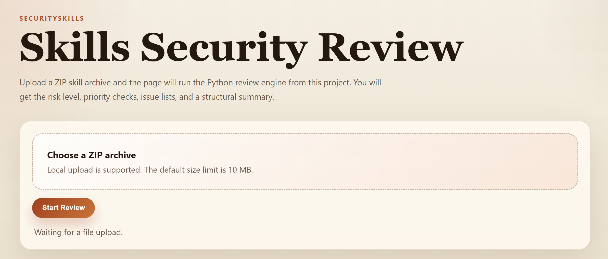

# SecuritySkills

SecuritySkills is a small standalone Flask app for reviewing uploaded skill archives.
It provides a simple web UI and a single JSON API for `.zip` file inspection.

## Features

- Upload a `.zip` archive from the browser
- Review archive contents without executing uploaded code
- Surface risk level, risk score, issues, observations, and archive highlights

## Files

- `app.py`: Flask entrypoint
- `engine.py`: core review engine
- `securityskills_utils.py`: standalone helpers
- `templates/index.html`: page template
- `static/app.js`: frontend logic
- `static/style.css`: page styles

## Run

```bash
pip install -r requirements.txt
python app.py
```

Open `http://127.0.0.1:5000` in your browser.

## API

```http
POST /api/review
```

Form field:

- `archive`: required `.zip` file

Default upload limit:

- `10 MB`

Example:

```bash
curl -X POST \
  -F "archive=@example-skill.zip" \
  http://127.0.0.1:5000/api/review
```

## Response

Successful responses include:

- `ok`
- `filename`
- `overall_level`
- `risk_score`
- `risk_counts`
- `issue_count`
- `observation_count`
- `archive`
- `checks`
- `highlights`
- `issues`
- `observations`

## Notes

- The scanner is heuristic-based and does not execute uploaded code.
- Only `.zip` uploads are supported in standalone mode.
- `routes.py` and `service.py` are still kept for host-project integration.

